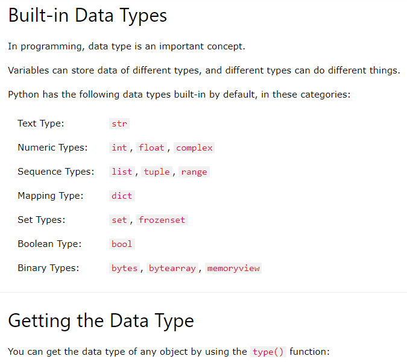
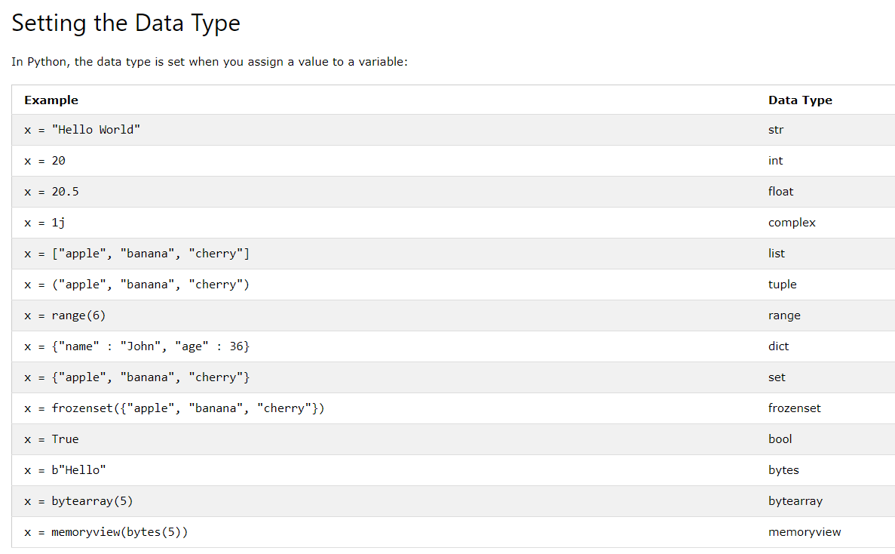
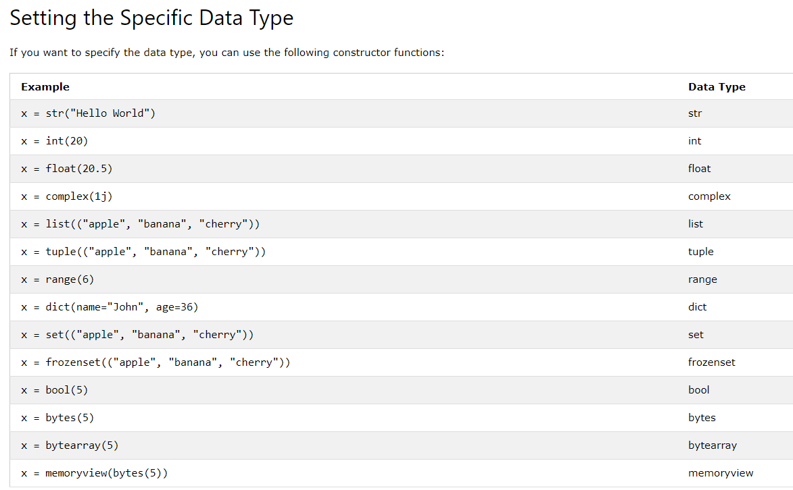
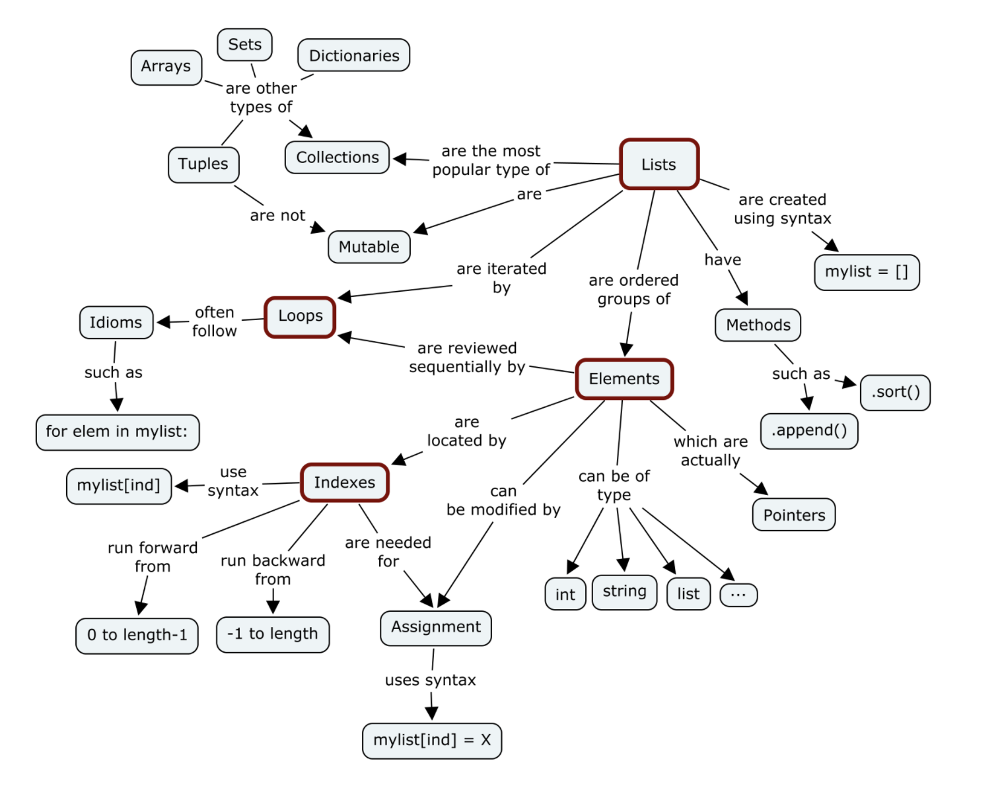
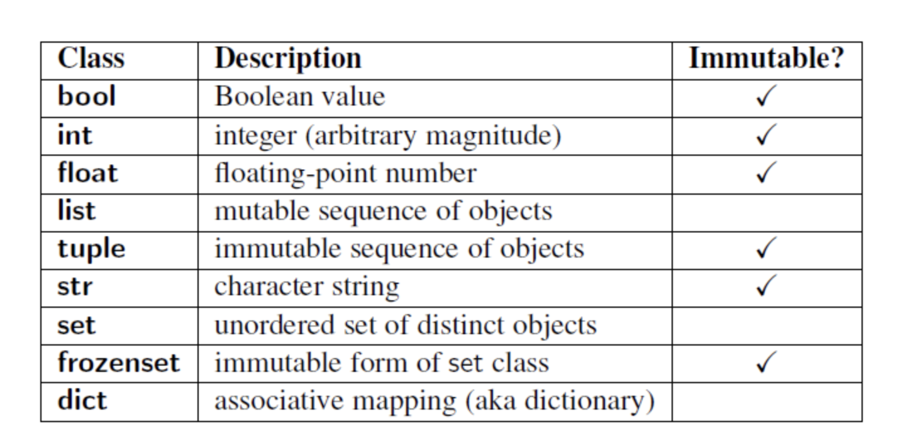
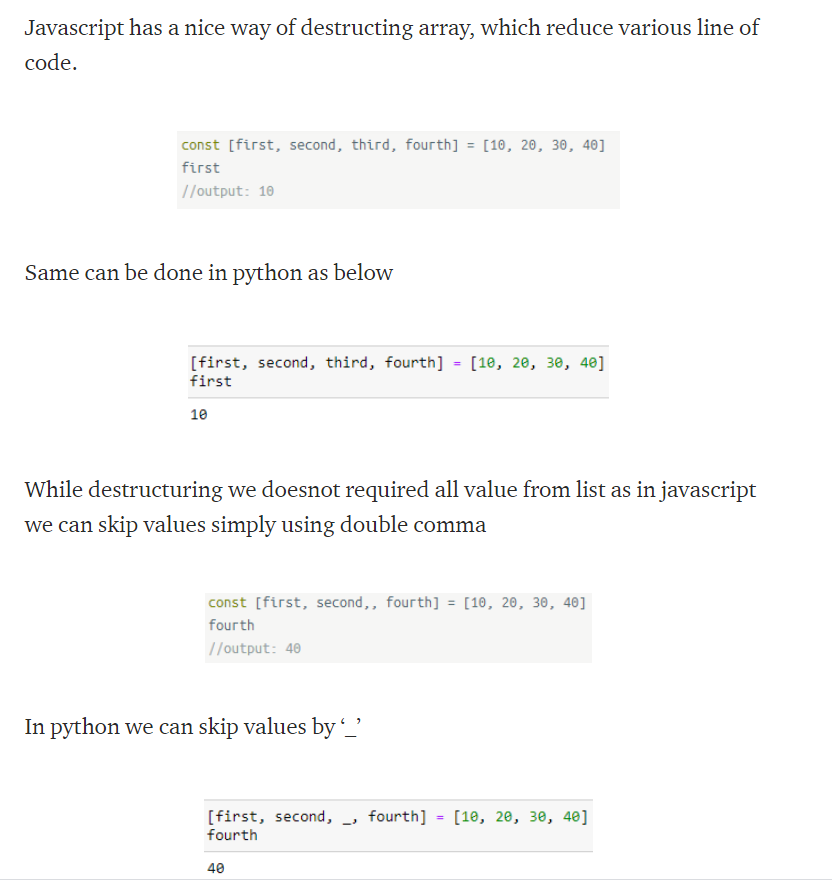
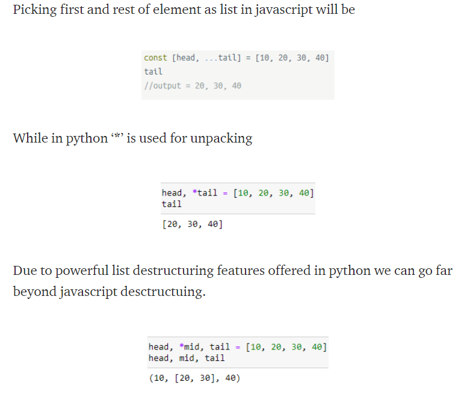
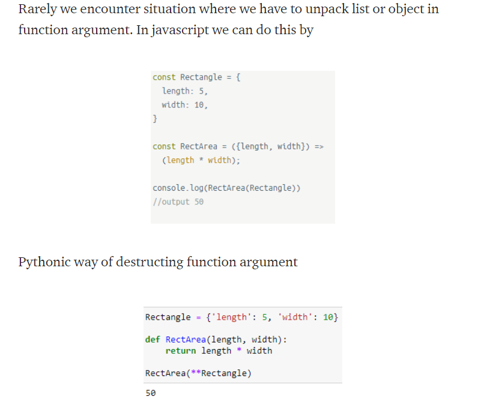
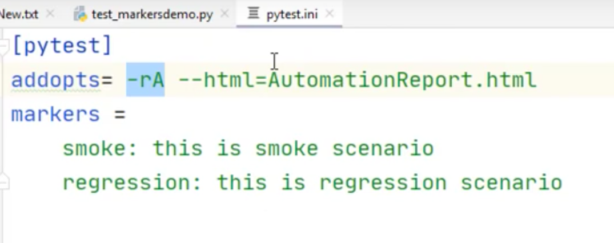

# TODO:

* (x)check iterables
* (x)mutable, immutable data types
* ways to iterate through iterables (map, reduce, filter, list comprehension, enumerate)
* (x)destructuring (unpacking of the arguments, rest operator)
* (x)ways to copy iterable types (e.g. lists, dicst)
* (x)ways to merge lists (dics) together.
* (x)function (args, kwargs, rest operator, how to pass object)
* (x)ways to check for data type (str, dict, list...)
* list methods
* string methods
* dictionary methods
  

# Good libraries to check out

* [itertools](https://docs.python.org/3/library/itertools.html)

# Random

## Pretty print Python dicts using json.dumps

```python
# The standard string repr for dicts is hard to read:
>>> my_mapping = {'a': 23, 'b': 42, 'c': 0xc0ffee}
>>> my_mapping
{'b': 42, 'c': 12648430. 'a': 23}  # 😞

# The "json" module can do a much better job:
>>> import json
>>> print(json.dumps(my_mapping, indent=4, sort_keys=True))
{
    "a": 23,
    "b": 42,
    "c": 12648430
}

# Note this only works with dicts containing
# primitive types (check out the "pprint" module):
>>> json.dumps({all: 'yup'})
TypeError: keys must be a string

# In most cases I'd stick to the built-in "pprint" module though :-)

```

## Pretty-print of data structure using pprint
> https://pymotw.com/2/pprint/


# Python Expressions vs Python Statements

* **Expressions** are representations of value. They are different from statement. 
* In the fact that **statements** do something while expressions are representation of value.

# Python modules and packages

* **module** is a .py file
* **package** is a folder with a bunch of .py files in it

inside of the module to import a class from another module of the same package, you need to write:

```python
from package_folder_name.subfolder.filename.py import some_class
```

# Data types
> https://www.w3schools.com/python/python_datatypes.asp







## Iterables

> An iterable is any Python object capable of returning its members one at a time, permitting it to be iterated over in a for-loop.

Example of iterables:

* List
* Tuple
* Dict
* Set
* String (can also be iterated through for in loop)

### Iterators

> https://www.w3schools.com/python/python_iterators.asp

An iterator is an object that can be iterated upon, meaning that you can traverse through all the values.

Technically, in Python, an iterator is an object which implements the iterator protocol, which consist of the methods __iter__() and __next__().


Iterables (described above) data type are iterable containers which you can get an iterator from. All these objects have a **iter()** method which is used to get an iterator.

> You could do the same for strings, lists etc

```python
mytuple = ("apple", "banana", "cherry")
myit = iter(mytuple)

print(next(myit)) # "apple"
```

> Note, that while looping from iterables via for-loop, it actually creates an iterator object and executes the next() method for each loop.

You can create you own iterator by implementing __iter__() and __next__() methods on your class.


To be able to use next() built in function, one needs to convert above mentioned data types to iterator by using iter() build in function

```python
mylist = iter(["apple", "banana", "cherry"])
x = next(mylist)
```

## Mutable and immutable objects (data types)

> [source](https://medium.com/@meghamohan/mutable-and-immutable-side-of-python-c2145cf72747#:~:text=Simple%20put%2C%20a%20mutable%20object,set%2C%20dict)%20are%20mutable.)





Good point to know

* Python handles mutable and immutable objects differently.
* Immutable are quicker to access than mutable objects.
* Mutable objects are great to use when you need to change the size of the object, example list, dict etc.. Immutables are used when you need to ensure that the object you made will always stay the same.
* Immutable objects are fundamentally expensive to “change”, because doing so involves creating a copy. Changing mutable objects is cheap.

# Writing the code

## Naming convensions

In Python functions are named according to underscore case like

```python
def hello_world():
    print("hello world")
```

## Type Hinting

> https://realpython.com/lessons/type-hinting/

> https://www.youtube.com/watch?v=2xWhaALHTvU

> a good type checking linter is **mypy-lang** (pip install mypy-lang)

Statically indicate the type of a value within your Python code

```python
def greet(name: str) -> str:
    return "Hello, " + name
```

## Docsting

> https://realpython.com/documenting-python-code/
> https://www.geeksforgeeks.org/python-docstrings/
> https://www.datacamp.com/community/tutorials/docstrings-python

> “Code is more often read than written.”
> — Guido van Rossum

> “It doesn’t matter how good your software is, because if the documentation is not good enough, people will not use it.“ -Daniele Procida

The docstrings can be accessed using the __doc__ method of the object or using the **help** function.

The docstrings are declared using ”’triple single quotes”’ or “””triple double quotes””” just below the class, method or function declaration.

### Commenting vs Documenting

* **Commenting** is describing your code to/for developers. The intended main audience is the maintainers and developers of the Python code.

> According to PEP 8, comments should have a maximum length of 72 characters.

  Serves multiple purposes:

  - Planning and reviewing
  - Code description
  - Algorithmic description
  - Tagging

**Documenting** code is describing its use and functionality to your users. While it may be helpful in the development process, the main intended audience is the users.

# Functions

## Passing by value, passing by reference

check the examples in 3.0.Functions.ipynb

## Keyword-only arguments (*,)
> https://treyhunner.com/2018/10/asterisks-in-python-what-they-are-and-how-to-use-them/

# Generators

> https://www.guru99.com/python-yield-return-generator.html

More examples are in 3.2.Generators.ipynb

Generators are functions that return an iterable generator object. The values from the generator object are fetched one at a time instead of the full list together and hence to get the actual values you can use a **for-loop, using next() or list()** method.

## When to use yield instead of return in Python
> https://www.geeksforgeeks.org/use-yield-keyword-instead-return-keyword-python/

The **yield** statement suspends function’s execution and sends a value back to the caller, but retains enough state to enable function to resume where it is left off. When resumed, the function continues execution immediately after the last yield run. This allows its code to produce a series of values over time, rather than computing them at once and sending them back like a list.

Return sends a specified value back to its caller whereas Yield can produce a sequence of values. We should use yield when we want to iterate over a sequence, but don’t want to store the entire sequence in memory.

Examples are in **Random.ipynd** file

## Understanding generators and yield keyword

> https://realpython.com/introduction-to-python-generators/

# Destructuring / unpacking

Examples are in 3.0.Functions.ipynb and in 8.Dictionaries.ipynb

> good source about destructuring (unpacking)
> https://stackabuse.com/unpacking-in-python-beyond-parallel-assignment/#:~:text=Unpacking%20in%20Python%20refers%20to,the%20iterable%20unpacking%20operator%2C%20*%20





# Dictionaries

You cannot copy a dictionary simply by typing dict2 = dict1, because: dict2 will only be a reference to dict1, and changes made in dict1 will automatically also be made in dict2.

There are ways to make a copy, one way is to use the built-in Dictionary method copy().

# Compound statements (if, while, with, for etc)

## "with" statement

> https://docs.python.org/3/reference/compound_stmts.html#the-with-statement
> https://www.geeksforgeeks.org/with-statement-in-python/

"with" statement allows you to ensure that a resource is "cleaned up" when the code that uses it finishes running, even if exceptions are thrown. It provides 'syntactic sugar' for **try/finally** blocks.

"with" statement helps avoiding bugs and leaks by ensuring that a resource is properly released when the code using the resource is completely executed.

```python
# file handling
  
# 1) without using with statement
file = open('file_path', 'w')
file.write('hello world !')
file.close()
  
# 2) without using with statement
file = open('file_path', 'w')
try:
    file.write('hello world')
finally:
    file.close()


# using with statement
with open('file_path', 'w') as file:
    file.write('hello world !')
```

The above with statement will automatically close the file after the nested block of code. (Continue reading to see exactly how the close occurs.) The advantage of using a with statement is that it is guaranteed to close the file no matter how the nested block exits. If an exception occurs before the end of the block, it will close the file before the exception is caught by an outer exception handler. If the nested block were to contain a return statement, or a continue or break statement, the with statement would automatically close the file in those cases, too.


# PyTest

> Source: https://www.youtube.com/watch?v=snDSB9b8v_E&t=1535s

Pytest will run all files from current dir / subdirect test_*.py or *_test.py
> that is for pytest to see your test cases, you need to name your files so that **test** word is present

> also for pytest to test multiple cases in the same file, functions need to have **test** in their names

To run a test, navigate to the folder with a test and type "pytest" in the terminal.

To see summary about not only failed tests, but also about passed ones

## Pytest commands

`pytest` - run a test suite from all the files in that folder and its subfolders

`pytest test_First.py` - run tests only from one file

`pytest test_First.py -k jenkins` - run tests only from one file and only those which have keyword "jenkins"

`pytest -rA` - make pytest output summary not only about failed but also about succeeded tests

`pytest -v` - verbose, print out more info

`pytest --junitxml="Report1.xml"` - will generate xml report

`pytest --html=report.html` - will generate html report

  > package [pytest-html](https://pypi.org/project/pytest-html/) is needed

`pytest -n auto` - run pytest on different CPU processes to speed up the tests

  > package [pytest-xdist](https://pypi.org/project/pytest-xdist/) needs to be installed

### Pytest custom markers

> to be able to use markers, you need to **import pytest** in the file

> if you use custom markers, you will get a warning message to terminal. To get rid of it, you may want to [register](https://docs.pytest.org/en/stable/mark.html) you custom markers with pytest.ini (see it in the folder)

> You could also pass into pytest.ini (a config file for pytest) all flags that you want to use with each test case (**addopts**)



`pytest --markers` - to list all the markers

`pytest -m smoke` - run tests with a custom marker called "smoke"

`pytest -m "smoke or regression"` - run tests with condition, either one marker or another

### Build-in markers

> See confitional and unconditionals skip markers in the example pytest/test_markers_skip_xfail.py

`@pytest.mark.skip`

`@pytest.mark.skipif`

`@pytest.mark.xfail` - to mark a test you expect to fail (feature not yet implemented or bug not yet fixed)

`@pytest.mark.parametrize` - allows one to define multiple sets of arguments and fixtures at the test function or class.

## Fixtures
> https://docs.pytest.org/en/stable/fixture.html

“Fixtures”, in the literal sense, are each of the arrange steps and data. They’re everything that test needs to do its thing.

You can think of a test as being broken down into four steps:

* Arrange
* Act
* Assert
* Cleanup

**Arrange** is where we prepare everything for our test. This means pretty much everything except for the “act”. It’s lining up the dominoes so that the act can do its thing in one, state-changing step. This can mean preparing objects, starting/killing services, entering records into a database, or even things like defining a URL to query, generating some credentials for a user that doesn’t exist yet, or just waiting for some process to finish.

**Act** is the singular, state-changing action that kicks off the behavior we want to test. This behavior is what carries out the changing of the state of the system under test (SUT), and it’s the resulting changed state that we can look at to make a judgement about the behavior. This typically takes the form of a function/method call.

**Assert** is where we look at that resulting state and check if it looks how we’d expect after the dust has settled. It’s where we gather evidence to say the behavior does or does not aligns with what we expect. The assert in our test is where we take that measurement/observation and apply our judgement to it. If something should be green, we’d say assert thing == "green".

**Cleanup** is where the test picks up after itself, so other tests aren’t being accidentally influenced by it.

At it’s core, the test is ultimately the act and assert steps, with the arrange step only providing the context. Behavior exists between act and assert.


# Good links

* Destructuring in Python
  > https://blog.tecladocode.com/destructuring-in-python/

* Destructuring List in Python like Javascript
  > https://medium.com/@umaramanat66/destructuring-list-in-python-like-javascript-f7d4c0968538

* Python VS ES6 syntax comparison
  > https://gist.github.com/revolunet/537a3448cff850231a74

* Digital Ocean Python tutorial
  > https://www.digitalocean.com/community/books/digitalocean-ebook-how-to-code-in-python

* Real Python tutorials
  > https://realpython.com/switching-to-python/

* Guru99 Python tutorials
  > https://www.guru99.com/python-tutorials.html